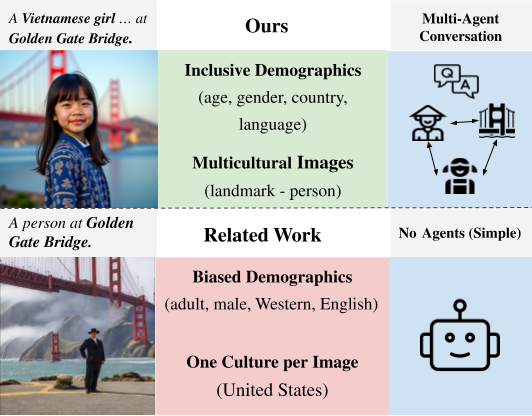

# MosAIG: Multicultural Text-to-Image Generation

This repository contains the code and data for our paper:

> **"When Cultures Meet: Multicultural Text-to-Image Generation"**  
> Parth Bhalerao, Oana Ignat, Brian Trinh, Mounika Yalamarty  
> *ACL Findings 2026*



## Overview

We introduce **multicultural text-to-image generation** as a new task, where a person from one cultural background is depicted in the context of a landmark from a different culture. We present **MosAIG**, a Multi-Agent framework for Image Generation that leverages LLMs with distinct cultural personas to generate richer, more culturally grounded image captions.

Our benchmark contains **9,000 images** spanning:
- 5 countries (United States, Germany, India, Spain, Vietnam)
- 5 languages (English, Hindi, German, Spanish, Vietnamese)
- 3 age groups (Child, Adult, Elder)
- 2 genders (Male, Female)
- 25 historical landmarks

---

## Repository Structure

MosAIG/
├── Alt/                            # AltDiffusion image generation pipeline
│   ├── AltDiffusion-m18-Running-Instructions.pdf
│   ├── BatchImageGenerationAltDiffusion.py
│   ├── PromptTranslation.py
│   ├── RunAltExtended.py
│   ├── main-2.py
│   └── main-3.py
├── Flux/                           # FLUX image generation pipeline
│   ├── BatchImageGenerationFlux.py
│   └── FluxNotebook.zip
├── Metrics-Code/                   # Evaluation metrics
│   ├── Metrics-1.py
│   ├── Metrics-2.py
│   ├── Metrics-3.ipynb
│   └── Metrics-4.ipynb
├── Multi-Agent-Setup/              # MosAIG multi-agent framework
│   ├── Final-Multi-V2.py
│   └── Simple-Crew-Setup.py
├── Single Agent Hardcoded Prompts/ # Simple baseline
│   └── SingleHardcoded-Prompts.py
├── data/                           # Metadata and example data
│   ├── example_data/
│   ├── Alt_MultiAgent.xlsx
│   ├── Alt_Simple.xlsx
│   ├── Flux_Multiagent.xlsx
│   └── Flux_Simple.xlsx
└── images/                         # Arch System Explain


---

## Dataset

The full dataset of 9,000 images along with metadata is available on HuggingFace:

🤗 **[AIM-SCU/Multi-Cultural-Single-Multi-Agent-Images](https://huggingface.co/datasets/AIM-SCU/Multi-Cultural-Single-Multi-Agent-Images)**

The `data/` folder in this repository contains the metadata spreadsheets with image captions and demographic keywords for all four model settings:
- `Alt_MultiAgent.xlsx` — AltDiffusion multi-agent captions
- `Alt_Simple.xlsx` — AltDiffusion simple captions
- `Flux_Multiagent.xlsx` — FLUX multi-agent captions
- `Flux_Simple.xlsx` — FLUX simple captions

---

## MosAIG Framework

MosAIG is a model-agnostic multi-agent prompting framework that decomposes cultural and demographic reasoning across three specialized agents:

- **Country Agent** — describes culturally appropriate attire and accessories
- **Landmark Agent** — describes architectural and environmental details
- **Age-Gender Agent** — describes demographic-specific physical traits

These agents interact over two rounds of conversation, supervised by a **Moderator Agent**, and the outputs are summarized by a **Summarizer Agent** into a final image caption (≤77 tokens).

The framework is implemented using [CrewAI](https://www.crewai.com/open-source) and LLaMA 3.1-8B.

---

## Models

We evaluate four model configurations:

| Model | Description |
|-------|-------------|
| **Alt-S** | AltDiffusion + simple prompt |
| **Alt-M** | AltDiffusion + multi-agent prompt |
| **Flux-S** | FLUX + simple prompt |
| **Flux-M** | FLUX + multi-agent prompt |

- **AltDiffusion** (`BAAI/AltDiffusion-m18`): multilingual open-source T2I model supporting 18 languages
- **FLUX** (`Freepik/flux.1-lite-8B-alpha`): state-of-the-art English-language T2I model

---

## Evaluation Metrics

We evaluate across five dimensions:

| Metric | Description |
|--------|-------------|
| **Alignment** | CLIPScore — text-image semantic correspondence |
| **Quality** | Inception Score — visual fidelity and diversity |
| **Aesthetics** | SigLIP-based aesthetic predictor (1–10 scale) |
| **Knowledge** | Sensitivity to landmark identity via caption swapping |
| **Fairness** | Consistency of performance across demographic substitutions |

---

## Requirements

```bash
pip install crewai
pip install diffusers transformers accelerate
pip install torch torchvision
pip install openai-clip
pip install pandas openpyxl
```

---

## Citation

If you use this work, please cite:

```bibtex
@inproceedings{bhalerao2026mosaic,
  title     = {When Cultures Meet: Multicultural Text-to-Image Generation},
  author    = {Bhalerao, Parth and Ignat, Oana and Trinh, Brian and Yalamarty, Mounika},
  booktitle = {Findings of the Association for Computational Linguistics: ACL 2026},
  year      = {2026}
}
```

---

## Links

- 📄 **Paper**: ACL Findings 2026
- 🤗 **Dataset**: [HuggingFace](https://huggingface.co/datasets/AIM-SCU/Multi-Cultural-Single-Multi-Agent-Images)
- 💻 **Code**: [GitHub](https://github.com/OanaIgnat/MosAIG)
